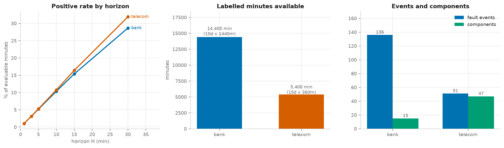
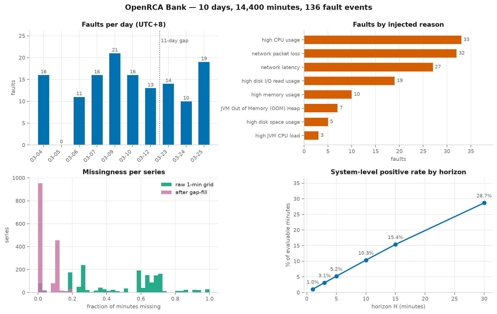
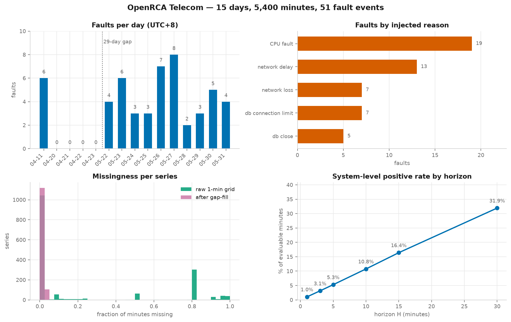
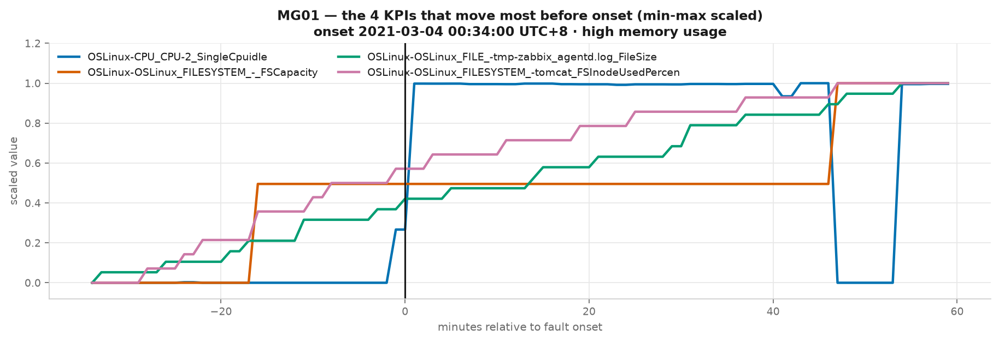
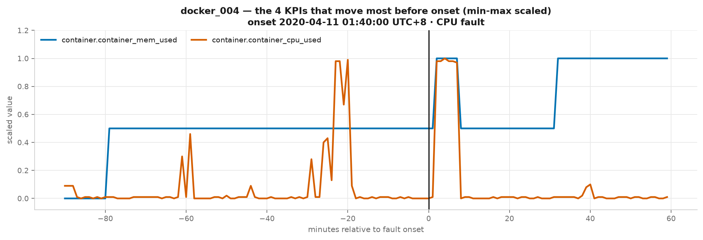
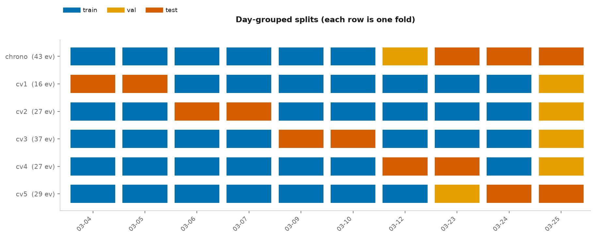
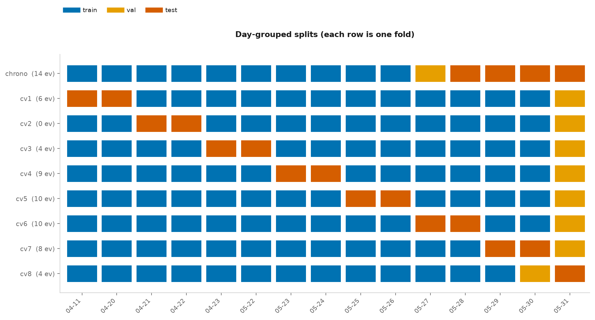

Slides: [slides.html](slides.html){target="_blank"} ( Go to `slides.qmd`
to edit)

## Introduction

Modern software systems generate large amounts of telemetry data, including
performance metrics, logs, and other operational signals. This information may
contain early warning signs of system failures; however, detecting those signs
can be challenging, especially in complex systems. Improving failure prediction
can help organizations respond earlier, reduce system downtime and associated
costs, and improve overall system reliability.

This project will use Microsoft's OpenRCA dataset [@xu2025openrca] to
investigate whether Long Short-Term Memory (LSTM) neural networks can predict
impending software-system failures from system telemetry. Because LSTMs are
designed to learn patterns over time, they may be useful for detecting changes
in telemetry data that occur before a system failure. We will evaluate how
accurately failures can be predicted at different time horizons and whether
combining multiple telemetry sources improves prediction performance compared
with using a single source. Overall, this project applies machine learning to a
practical software reliability problem by testing the effectiveness of telemetry
data for early failure detection.

Previous research is supportive of using LSTM models in the analysis of sequential data.
[@Gonzalez2018] showed that LSTM networks can be used in modeling nonlinear systems,
while [@ErgenKozat2020] used LSTM-based methods for anomaly detection in data sequences
with variable length. Other studies applied LSTMs to telemetry data obtained from computer
systems. [@MudgalWouhaybi2024] used a combined LSTM encoder in anomaly detection methods;
these include Isolation Forest, used to identify PC system failures from CPU, memory, disk,
temperature, and system data. This study obtained results that suggested LSTM-based telemetry
analysis can provide useful results for system-failure detection.

System log research also shows how important sequential modeling can be in failure-related
tasks. [@Chen2022] used two LSTM networks in the analysis of events before and after a log
entry; this improved anomaly detection in long log sequences. In addition, [@Hadadi2024]
researched deep learning for log-based failure prediction and found that model performance is
dependent on how log data are represented and transformed into sequences. The OpenRCA dataset
will be particularly useful in this project as it contains real failure case data from enterprise
systems, with multiple sources of telemetry, such as logs, metrics, and traces [@Xu2025].
While the prior work mentioned mainly focused on anomaly detection or cause analysis, this
project will be more focused on predicting failures before they occur and testing the efficacy
of multiple telemetry sources in improving early failure prediction performance.

## Methods

## Analysis and Results

### Data Exploration and Visualization

A study was conducted to determine how effectively LSTM networks can predict software-system failures before they happen, using multivariate telemetry, and whether they beat classical models given the same inputs. This section describes the data, how it was turned into a supervised learning problem, and what we found before any model was trained.

#### Data sources and collection process

The data comes from **OpenRCA**, a public root-cause-analysis benchmark of microservice systems with injected faults. We use two of its systems:

| | **Bank** | **Telecom** |
|---|---|---|
| Days | 10 (2021-03-04 to 03-25, not consecutive) | 15 (2020-04-11 to 05-31, not consecutive) |
| Coverage per day | 1,440 min (full day) | 360 min (00:00–05:59 only) |
| Labelled minutes | 14,400 | 5,400 |
| Metric sources | container, app | node, container, middleware, service, app |
| Components kept | 15 of 18 | 47 of 51 |
| Features after cleaning | 1,565 | 1,222 |
| Fault events | 136 (8 types) | 51 (5 types) |
| Missing data left after filling | 4.5 % | 1.1 % |

**Telemetry.** Each day folder holds metric CSVs that record a timestamp, a component and a KPI (key performance indicator, such as CPU use). Bank timestamps are in seconds and Telecom timestamps are in milliseconds. Logs and traces are also available but are out of scope.

**Ground truth.** Each system has a `record.csv` that lists every injected fault with its onset time, component and fault type. It gives no duration.

**Processing (Stage 1, `build_dataset.py`):**

1. Pivot each day into a wide table of minute × `component‖kpi` on an exact 1-minute grid. Telecom features are keyed `component‖family.kpi` because some KPI names repeat across metric families.
2. Keep only series that appear on every day. Bank's `dockerA1/A2/B1/B2` containers mostly disappear by 03-24, which removes 248 series. Telecom loses 430 series this way.
3. Drop series that are more than 80 % missing: 120 for Bank, 421 for Telecom.
4. Forward-fill gaps within a day, up to twice each series' own sampling interval.
5. Build labels: `y[t, H] = 1` if any fault starts within `(t, t+H]`, for H ∈ {1, 3, 5, 10, 15, 30} minutes.

**Two rules that keep the evaluation honest:**

- **Blackout.** The 10 minutes after each fault onset are excluded from the negative examples, so a model is never credited for detecting a fault that has already started.
- **Window completeness.** A minute is only used if its 60-minute look-back and its H-minute look-ahead both fall inside the same day. Because the days are not consecutive, a window would otherwise join 03-12 directly to 03-23.

**Timezone.** All OpenRCA timestamps are UTC+8. We join data only on raw epoch values and show times only in UTC+8. `verify_stage1.py` checks that this reproduces the `datetime` column of `record.csv` for all 136 Bank faults. Rendering in local US time would shift every label by 14 hours.

#### Initial findings

##### Figure 1 — Dataset comparison



- **Positive rates are almost the same in both systems.** They rise roughly linearly from about 1.04 % at H = 1 to 28.7 % (Bank) and 31.9 % (Telecom) at H = 30. Both systems have exactly 9.44 faults per 1,000 minutes, so results at the same horizon can be compared directly.
- **The real sample size is the number of faults, not the number of minutes.** Tens of GB of raw telemetry reduce to 136 and 51 fault events. Telecom has about 2.7× fewer events but about 3× more components (47 vs 15). That makes it the harder problem: more features per event and wider confidence intervals (roughly 1.6× wider).

| H (min) | Bank positives / evaluable | Bank rate | Telecom positives / evaluable | Telecom rate |
|---|---|---|---|---|
| 1 | 129 / 12,382 | 1.04 % | 42 / 4,033 | 1.04 % |
| 3 | 386 / 12,370 | 3.12 % | 126 / 4,003 | 3.15 % |
| 5 | 642 / 12,363 | 5.19 % | 210 / 3,974 | 5.28 % |
| 10 | 1,279 / 12,358 | 10.35 % | 420 / 3,904 | 10.76 % |
| 15 | 1,902 / 12,368 | 15.38 % | 630 / 3,839 | 16.41 % |
| 30 | 3,573 / 12,459 | 28.68 % | 1,217 / 3,812 | 31.93 % |

##### Figure 2 — Per-system overview





**Bank:**

- **Faults per day** range from 10 to 21. There is an 11-day gap between 03-12 and 03-23.
- **Fault types are imbalanced.** High CPU (33), network packet loss (32) and network latency (27) make up 68 % of faults. JVM CPU load (3) and disk space (5) are too rare to evaluate on their own.
- **Missing data per series** comes in two clusters in the raw 1-minute grid: about 20–30 % and about 60–70 %. These match KPIs sampled every 2 minutes and KPIs sampled hourly; about 48 % of grid cells are empty. After forward-filling, most series are near 0 % missing, with a second peak around 10 %.

**Telecom:**

- **Faults are concentrated in the May block.** 04-11 has 6 faults, 04-20 to 04-23 have none, and the 11 days from 05-22 to 05-31 hold the other 45 (2–8 per day). There is a 29-day gap between 04-23 and 05-22.
- **Fault types:** CPU fault (19) and network delay (13) make up 63 %. Network loss (7), db connection limit (7) and db close (5) are small classes.
- **Missing data is mostly a sampling-rate effect.** Most series are almost complete in the raw grid; the rest cluster near 80 % and 90–100 % missing. After forward-filling, nearly all series are at about 0 %, leaving 1.1 % residual missingness.

##### Figure 3 — Single-fault close-ups





Each panel shows the first fault with at least 30 minutes of same-day history; the window never crosses a day boundary.

**Bank** shows a high-memory fault on `MG01` on 03-04, with the 4 KPIs that change most around the onset (scaled to 0–1). Two KPIs, filesystem capacity and the zabbix agent log size, start changing **15–20 minutes before** onset. CPU idle changes sharply only at onset. So at least some faults leave signs in the telemetry before they begin, which is the premise of the study.

**Telecom** shows a CPU fault on `docker_004` at 01:40 on 04-11. Telecom containers expose only two KPIs, CPU and memory used. CPU use jumps sharply at onset and stays high for about 6 minutes. There is also a similar CPU burst about 20–25 minutes *before* onset that returns to baseline. A model could read that burst as a warning sign, or it could be unrelated background load that would cause false alarms. One event cannot tell these apart.

##### Figure 4 — Train/validation/test splits





All splits are grouped by day, so minutes from the same day never appear in both training and testing.

- **Bank** (chronological + 5 CV folds): test folds hold between 16 and 43 events.
- **Telecom** (chronological + 8 CV folds): test folds hold between **0 and 14** events. Fold `cv2` (test days 04-21 and 04-22) contains **no faults at all**, and `cv3` and `cv8` hold only 4 each.

#### Unexpected patterns and anomalies

1. **Some days have telemetry but no faults.** Checked against the raw `record.csv` (by epoch and by its own `datetime` column):
   - **Bank:** 2021-03-05 has 0 of 136 faults, although its container metrics (~86 MB) are as complete as any other day's. Its `metric_app.csv` is under half the size of 03-04's, which is worth a look.
   - **Telecom:** 2020-04-20 to 04-23 (four consecutive days) have 0 of 51 faults, despite about 40 MB of metrics each.

   These may be fault-free baseline periods or gaps in the labels; OpenRCA does not say which. Either way, they are negative-only days, and the evaluation has to account for them.
2. **Fault-free days break some test folds.**
   - Bank `cv1` has only 16 test events (below the planned 20–30) because one of its test days is 03-05.
   - Telecom `cv2` has **0** test events, so PR-AUC, event recall and lead time are undefined for that fold. `cv3` and `cv8` have only 4 events each, so one fault changes event recall by 25 points.
   - Folds should be built to balance events rather than days, or zero-event folds should be reported as false-alarm-only folds rather than averaged in.
3. **The set of components changes over time.** The `dockerA*/B*` containers are present early and mostly gone by 03-24. A chronological test on 03-23 to 03-25 therefore sees a different system from the one the model was trained on. Chronological results will be worse than cross-validation results, and this is a real, reportable source of distribution shift rather than noise.
4. **The memory fault in Figure 3 is not visible in memory KPIs.** The strongest early signals are filesystem and log-size growth, and CPU idle (scaled) rises at onset. Fault labels describe what was injected, not how it shows up. Assuming that a "memory" fault will appear in memory metrics would be wrong, which supports models that see all features over models built on hand-picked ones.
5. **Telecom only covers 00:00–05:59.** A time-of-day feature has only 360 possible values there, all overnight. Any time-of-day control result on Telecom will mean something very different from Bank's.
6. **At H = 30, almost a third of minutes are positive.** At that horizon the task is closer to "is this a busy period?" than to prediction. A time-of-day-only control model is included to detect this.

#### Implications for modeling

- Splits must be grouped by day. Adjacent minutes are near-duplicates, and shuffling them inflates ROC-AUC to about 0.99.
- The main metric should be PR-AUC reported next to the base rate, plus event-level recall and lead time. Accuracy is meaningless at a 1 % positive rate.
- Confidence intervals should come from a bootstrap over events, not minutes. With 136 events, PR-AUC differences under about 0.05 are not significant.

### Modeling and Results

-   Explain your data preprocessing and cleaning steps.

-   Present your key findings in a clear and concise manner.

-   Use visuals to support your claims.

-   **Tell a story about what the data reveals.**

```{r}

```

### Conclusion

-   Summarize your key findings.

-   Discuss the implications of your results.

## References
